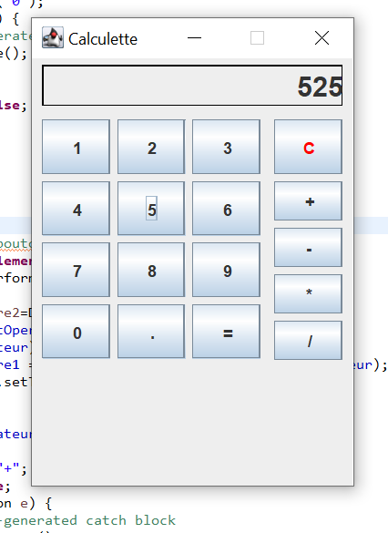
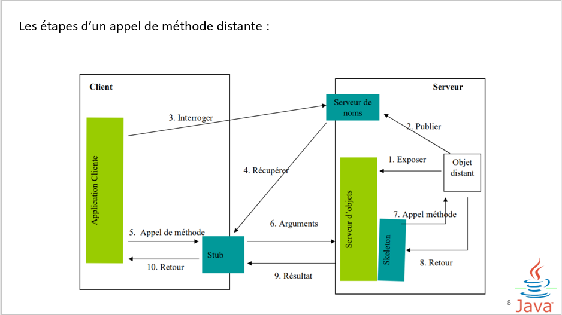
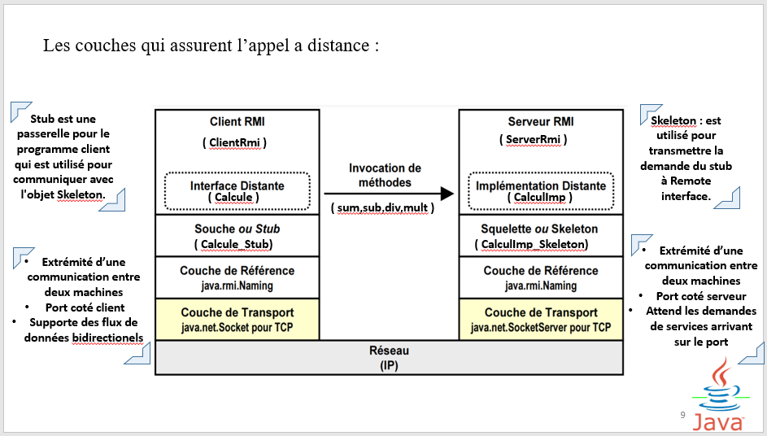
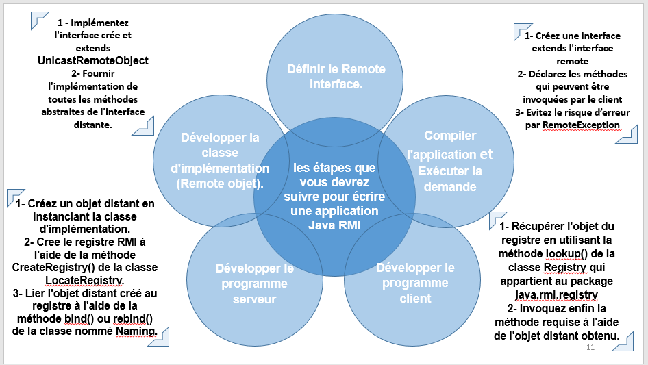
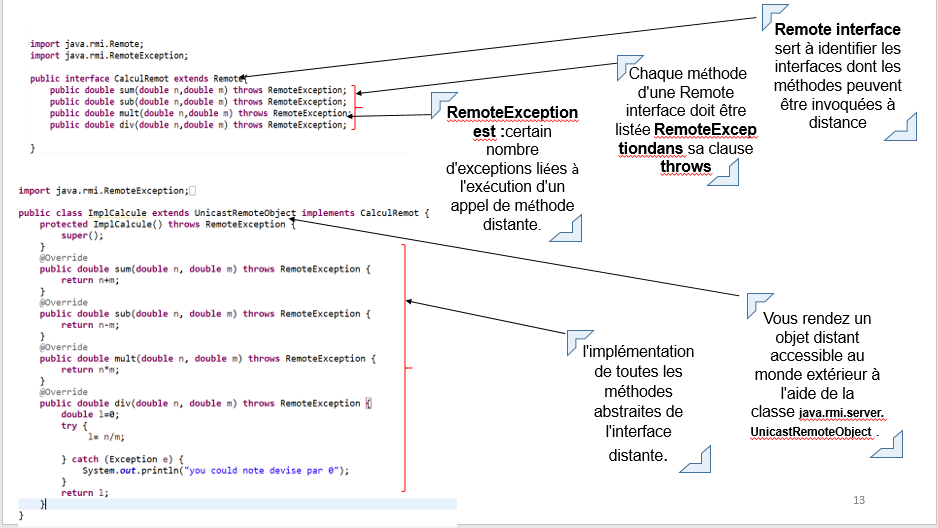
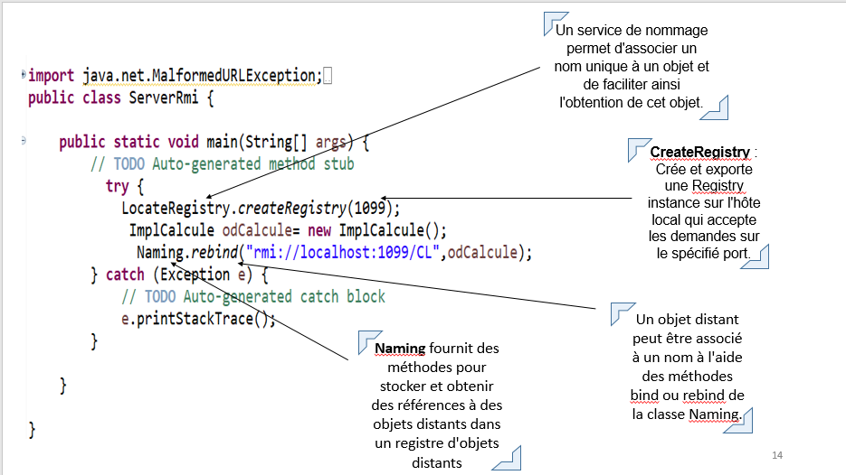
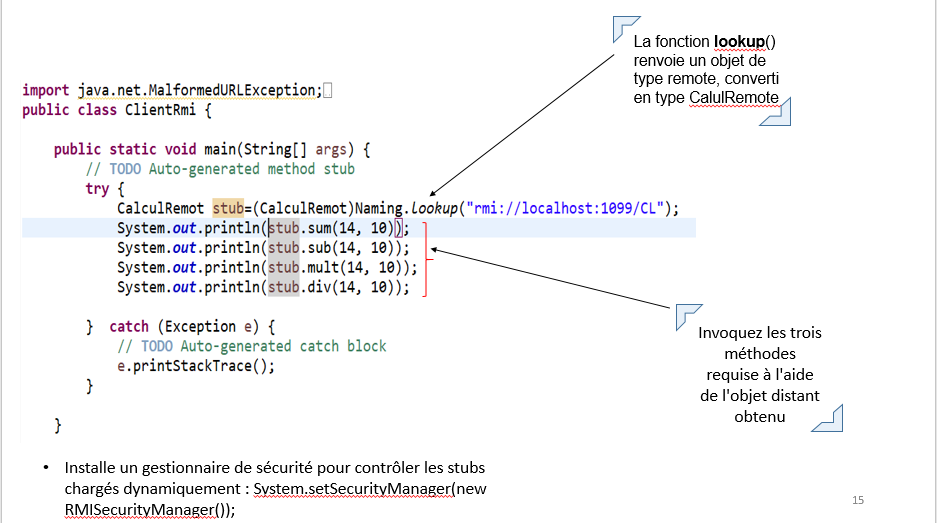

# JAVA-RMI-SIMPLE-CALCULATOR-WITH-GRAPHIC-INTERFACE
SIMPLE APPLICATION JAVA RMI SIMPLE CALCULATOR WITH GRAPHIC INTERFACE USING ECLIPSE
## Code Interface Execution:
 

## RMi definition:
RMI (remote method invocation) est spécifique au langage Java. C’est un ensemble de classes et d’outils de mise en œuvre permettant à des objets distribués sur différents sites ou sur une même plate-forme de communiquer entre eux. On rappelle que les objets Java sont exécutés par la machine virtuelle Java appelée la JVM (Java virtual machine )

L'appel des méthodes à distance ou méthode d’objet distribuées a été introduit pour la première fois en 1997 dans Java Development Kit (JDK) 1.1 et est largement utilisé dans le calcul d'objets distribués. Il effectue l'équivalence orientée objet des appels de procédure distante

## Les composants de coté serveur et coté client
La méthode Java RMI se base sur  une  L’architecture client-serveur.  
Quelles les composants de chaque coté ?  
__Coté Serveur :__  
*Une interface qui contient les méthodes qui peuvent être appelées à distance.  
*L’écriture d'une classe qui implémente cette interface  
*L’écriture d'une classe qui instanciera l'objet et l'enregistrer dans rmi registre. 
__Coté Client :__
*Une interface qui contient les méthodes qui peuvent être appelées à distance.  
*L’écriture d’une classe qui nous permettons d’accès à l'objet distant. 

__Les étapes d’un appel de méthode distante :__ 
 

 

__les étapes que vous devrez suivre pour écrire une application Java RMI__  
 

__Les classes et les interfaces utilisés dans une application java RMI__ 

 
 
 

##Conclusion :
Comme nous venons de le voir, RMI permet aux objets Java et à leurs méthodes d’une application répartie de devenir distants relativement facilement.

